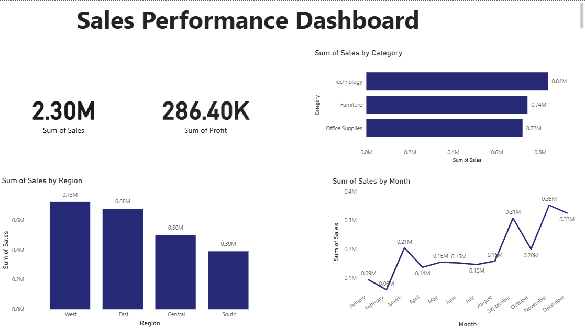

# 📊 Sales Performance Dashboard

An end-to-end data analytics project using **Excel, Python, SQL, and Power BI** to analyze retail sales data, uncover profitability issues, and identify seasonal and customer trends.



---

## 🧰 Tools Used
| Tool | What it was used for |
|---|---|
| **Excel** | Data cleaning, pivot tables (Region, Category, Month) |
| **Python (pandas)** | Data cleaning, date format fixing, groupby analysis |
| **SQL (SQLite)** | Profitability analysis, monthly trends, customer segmentation |
| **Power BI** | Interactive dashboard with KPI cards and charts |

---

## 📁 Dataset
This project uses the **Sample Superstore** dataset — a publicly available retail sales dataset (~9,800 orders) commonly used for analytics practice.

---

## 🔍 Key Insights

### 1. Heavy discounting is erasing profit on specific products
The **GBC DocuBind P400 Electric Binding System** is discounted by an average of **45%**, resulting in a net loss of **~$1,878** despite generating **$17,965** in sales. By comparison, the HON 5400 Series Task Chairs are discounted more moderately (20%) and roughly break even.

> 💡 **Takeaway:** There's a direct link between excessive discounting and unprofitability. The business should consider capping discounts on certain product lines to protect margin.

*(See the SQL notebook in this repo for the full query behind this finding.)*

### 2. Revenue is strongly seasonal — peaks in Nov/Dec, dips every February
Revenue spikes every November-December across all four years in the dataset, with **November 2017** the highest-revenue month overall at **$118,447** — consistent with holiday shopping demand. **February is consistently the weakest month** every year.

> 💡 **Takeaway:** Plan inventory and staffing around the predictable Nov-Dec surge, and consider targeted promotions to lift the slower February period.

### 3. The Home Office segment is smaller but more profitable per order
| Segment | Customers | Total Sales | Avg. Profit/Order |
|---|---|---|---|
| Consumer | 409 | $1.16M | $25.80 |
| Corporate | 236 | $706K | $30.50 |
| **Home Office** | **148** | $430K | **$33.80** |

> 💡 **Takeaway:** Home Office customers are disproportionately valuable — nearly 30% more profitable per order than Consumer — and could be a strong target for a loyalty or expansion campaign.

---

## 📈 Dashboard Features
- KPI cards for total sales (**$2.30M**) and total profit (**$286.40K**)
- **Sales by Category** — Technology leads at $0.84M, followed by Furniture ($0.74M) and Office Supplies ($0.72M)
- **Sales by Region** — West leads at $0.73M, followed by East ($0.68M), Central ($0.50M), and South ($0.39M)
- **Sales by Month** — clearly shows the seasonal pattern described above, dipping to $0.06M in February and climbing to $0.35M in November

---

## 📂 Repository Contents
```
├── 01_data_cleaning_analysis.ipynb  # Python cleaning + groupby analysis notebook
├── 02_sql_queries.ipynb             # SQL analysis notebook (profit, trends, segments)
├── superstore_final_clean.xlsx      # Cleaned dataset
├── sales_dashboard.pbix             # Power BI dashboard file
├── dashboard_screenshot.png         # Dashboard preview image
└── README.md
```

---

## 🧠 What I Learned
- How to diagnose and fix mixed date formats — a common real-world data quality issue — using pandas' `format="mixed"` parameter.
- How to move the same analysis across four different tools and cross-validate results (e.g., region rankings matched between SQL and Power BI).
- How to turn raw aggregate numbers into specific, evidence-backed business recommendations rather than just reporting totals.

---

## 🔗 Connect
Built by Akshay K — feel free to reach out or connect on [LinkedIn](https://www.linkedin.com/in/akshay-k-779168251).
